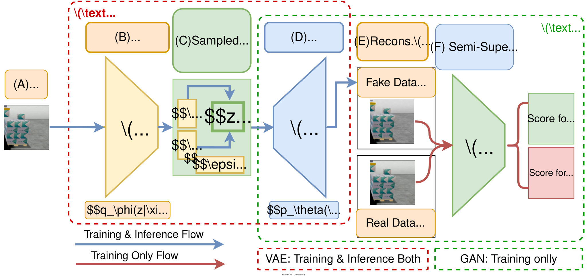

# DistriMuSe-UC3

> **University of Torino** — Distributed Multi-Sensor Systems for Human Safety and Health

---


<a href="https://github.com/rashidrao-pk/advis_distrimuse_unito"></a>
<a href="https://github.com/rashidrao-pk/advis_distrimuse_unito/commits/main"></a><a href="https://github.com/rashidrao-pk/advis_distrimuse_unito/graphs/contributors"></a>
<a href="https://github.com/rashidrao-pk/advis_distrimuse_unito/commits/main"></a>

## Use Case 3 · Safe Interaction with Robots

An industrial anomaly detection framework for collaborative robotic environments using VAE-GAN models. The system monitors predefined safety areas in real time, detects unexpected conditions through reconstruction-based anomaly scoring, and supports training, threshold calibration, and live inference on multiple video sources.

---

## Key Features

- Real-time anomaly detection for collaborative robotics
- VAE-GAN based reconstruction learning
- Per-area safety monitoring
- Multi-source inference support
- Threshold calibration framework
- Support for live camera streams
- Industrial safety-area preprocessing pipeline
- Compatible with synthetic and real robotic datasets


## Pipeline Overview

```
Raw Video → Preprocessing → Training → Threshold Calibration → Inference
```

### Workflow
<p align="center">
  <br>
  Pipeline for training, calibration, and real-time anomaly detection in collaborative robotic environments.
</p>

## VAE-GAN Model Architecture

<p align="center">
    <br>
    VAE-GAN model's architecture.
</p>


## Data Preprocessing

<p align="center">
  <br>
  Data Preprocessing pipeline.
</p>


## Sample Results

<p align="center">
  <br>
  Sample Results.
</p>


| Stage | Script | Description |
|---|---|---|
| Preprocess | — | Crop safety areas from 2540px-wide video, resize to 128×128 |
| Train | `scripts/train.py` | Train autoencoder per safety area |
| Compute Threshold | `scripts/compute_threshold.py` | Estimate reconstruction-error thresholds on validation data |
| Calibrate Threshold | `scripts/calibrate_threshold.py` | Tune thresholds using labelled or unlabelled data |
| Inference | `scripts/inference.py` | Run anomaly detection on preprocessed frames, raw frames, video, or live stream |

---

## Safety Areas

| ID | Description |
|---|---|
| `RoboArm` | Robot arm zone |
| `ConvBelt` | Conveyor belt zone |
| `PLeft` | Personnel zone — left |
| `PRight` | Personnel zone — right |
| `ALL` | Run all areas sequentially |

## ⚙️ 1. Setup
### 1.1 Create environment


```bash
conda create -n dm_unito python==3.9.18
conda activate dm_unito
conda install pytorch torchvision torchaudio pytorch-cuda=11.8 -c pytorch -c nvidia

```

### 1.2 Clone GitHub Repo

```bash
git clone https://github.com/rashidrao-pk/distrimuse_unito
conda activate dm_unito
pip install -r requirements.txt
```

### 1.3 Retrieve Model Checkpoints (Demo 3.2 & Demo 3.3)
Model Checkpoints are separately provided and are available at following GitLab repo
-   [https://GitLab.di.unito.it/rashid/**_`dm_checkpoints_demo32`_**](https://gitlab.di.unito.it/rashid/dm_checkpoints_demo32)
-   [https://GitLab.di.unito.it/rashid/**_`dm_checkpoints_demo33`_**](https://gitlab.di.unito.it/rashid/dm_checkpoints_demo33)

#### Demo 3.2

Download model checkpoints uploaded on following `GitLab` repo for `Synthetic Palletizing` dataset (dataset provided by `Valeria-Lab, University of Granada`, Spain for `DEMO-3.2` of UC3):

```bash
cd distrimuse_unito/scripts
git clone https://gitlab.di.unito.it/rashid/dm_checkpoints_demo32 origin-url   # FOR Simulated ROBOT Palletizing - DEMO 3.2
cd ..
```

> [!NOTE]
> Model checkpoints are not included in the repository because of file size limitations.

> [!WARNING]
> Thresholds are dataset-specific and should be recalibrated for new environments.

---
---

## 2. Train

Train a `VAE-GAN` model on one (`PLeft`, `PRight`, `RoboArm`, `ConvBelt`) or all safety areas.

```bash
# Single area (default settings)
python scripts/train.py --safety_area RoboArm
```

```bash
# All areas sequentially
python scripts/train.py --safety_area ALL
```

```bash
# All areas with custom settings
python scripts/train.py --safety_area ALL --epochs 1000 --batch_size 64
```

**Full argument reference**

| Argument | Type | Default | Description |
|---|---|---|---|
| `--safety_area` | `str` | `RoboArm` | Area to train (`RoboArm`, `ConvBelt`, `PLeft`, `PRight`, `ALL`) |
| `--epochs` | `int` | `1000` | Number of training epochs |
| `--batch_size` | `int` | `64` | Batch size (set automatically based on device if omitted) |
| `--data_split` | `int` | `80` | Train/validation split percentage (remainder used for validation) |
| `--augmentation_level` | `int` | `0` | `0` = none, `1` = custom augmentation |
| `--verbose_level` | `int` | `0` | `0` = silent, `1` = standard, `2` = detailed |
| `--save_figures` | flag | off | Save reconstruction plots, learning curves, and latent space visualisations |

### 2.1 Train with allow/ignore Intermediate Results

This will allow to train VAE-GAN models to allow/ignore intermediate results/figures to store.


```bash
# Fast mode — saves curves and checkpoints only
python scripts/train.py --safety_area RoboArm
```

```bash
# Full mode — also saves reconstruction figures
python scripts/train.py --safety_area RoboArm --save_figures
```

---

## 3. Threshold Estimation and Calibration

### 3.1 Compute Threshold with Validation-set (Subset of Train-set)
- Estimate per-area anomaly `thresholds` from `reconstruction errors` on the `validation` set (ratio used as `80/20`).

```bash
# Validation mode — no labels required
python scripts/calibrate_threshold.py --mode val --safety_area ALL
```

or 
### 3.2 Compute Threshold with Test-set
- Calibrate `thresholds` using labelled test set (containing both `normal` and `anomalous` data).

```bash
# Test mode — labelled CSV required
python scripts/calibrate_threshold.py --mode test --safety_area ALL \
    --gt_csv scripts/data/annotations/anom_metadata_unexpected_person.csv
```

```bash
# Test mode — tune monitoring metric and search grid
python scripts/calibrate_threshold.py --mode test --safety_area RoboArm --gt_csv scripts/data/annotations/anom_metadata_unexpected_person.csv --monitor_score recall --offset_ls 1,2,3 --sigma_ls 0.0,0.5,1.0,1.5
```

---

## 4. Inference

Run anomaly detection from multiple `input sources` including following input sources;


### 4.1 Data source options

| `--data_source` | Input | Notes |
|---|---|---|
| `preprocessed` | Pre-cropped image folder | Fastest; requires prior preprocessing |
| `raw` | Raw frame folder | Crops and resizes on the fly |
| `video` | `.avi` / video file | Supports `--max_frames` limit |
| `ipcam` | RTSP stream URL | For live camera feeds |


### 4.2 Scripts:
```bash
# Pre-cropped frames, evaluate against annotations
python scripts/inference.py --data_source preprocessed --input_dir /home/unito/data/DS/ValeriaLab/V6/fronttop/test_processed/unexpected_person --safety_area RoboArm --gt_csv scripts/data/annotations.csv
```

```bash
# Raw video frames, all areas, save output figures
python scripts/inference.py \
    --data_source raw \
    --input_dir /data/frames \
    --safety_area ALL \
    --save_figures
```

```bash
# Video file, process first 500 frames
python scripts/inference.py \
    --data_source video \
    --input_video /data/test.avi \
    --max_frames 500
```

```bash
# Live IP camera stream, all areas
python scripts/inference.py \
    --data_source ipcam \
    --camera_url rtsp://192.168.1.10/stream \
    --safety_area ALL \
    --save_figures
```

---

## Repository Structure

```text
distrimuse_unito/
├── docs/
├── scripts/
│   ├── train.py
│   ├── compute_threshold.py
│   ├── calibrate_threshold.py
│   ├── inference.py
│   ├── data/
│   │   └── annotations/
│   └── results/
│       ├── models/
│       ├── thresholds/
│       └── training/
├── README.md
├── CONTRIBUTING.md
├── LICENSE
└── requirements.txt
```

---

## Publications

### Explainable Anomaly Detection Case Study
- Muhammad Rashid et al.
- *ShapBPT in Perspective: A Consolidated Review and an eXplainable Anomaly Detection Case Study*
- QualITA Workshop @ ICPE 2026

### Related Research
- *Can I Trust My Anomaly Detection System? A Case Study Based on Explainable AI*
- https://arxiv.org/abs/2407.19951

## Acknowledgements

Developed at the **University of Torino** as part of the [**_DistriMuse_**](https://distrimuse.eu/) project on distributed multi-sensor systems for human safety and health.

## Keywords

Anomaly Detection · VAE-GAN · Explainable AI · Industrial AI · Collaborative Robotics · Computer Vision · Safety Monitoring
